# KiCad STM32 + USB + Buck Converter PCB Design and JLCPCB Assembly

## Links

- [Fabricante de PCB](https://jlcpcb.com/).
- [Componentes](https://jlcpcb.com/parts).
- [Microcontrolador STM32 F4](https://jlcpcb.com/partdetail/Stmicroelectronics-STM32F405RGT6/C15742).
- [Conversor Buck](https://jlcpcb.com/partdetail/Monolithic_PowerSystems-MP2359DJ_LFZ/C14259).
- [Protección ESD para el USB](https://jlcpcb.com/partdetail/Stmicroelectronics-USBLC62SC6/C7519).
- [Cristal 16Mhz](https://jlcpcb.com/partdetail/Yxc_CrystalOscillators-X322516MLB4SI/C13738).
- [Protección Polaridad Inversa](https://jlcpcb.com/partdetail/Alpha_OmegaSemicon-AO3401A/C15127).
- [Ferrite para Conversores Buck](https://jlcpcb.com/partdetail/Sunlord-GZ2012D601TF/C1017).
- [Diodo Schottky recomendado para Conversores Buck](https://jlcpcb.com/partdetail/mdd_microdiode_semiconductor-B5819W/C64885).
- [Inductor de potencia para Conversores Buck](https://jlcpcb.com/partdetail/Sunlord-MWSA0503S100MT/C408412).

❗Minimizar el uso de extended parts y usar las basic para minimizar el costo del PCB.

## STM32CubeIDE

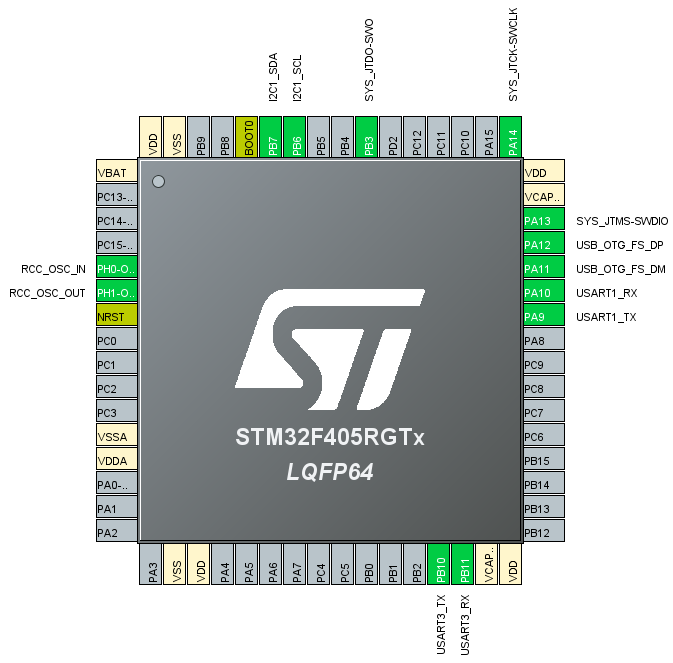

📝En lo posible, colocar los buses de comunicación en distintos laterales del microcontrolador. Y si no se puede, colocarlos lo mas separados que se pueda dentro del mismo lateral.

❗En la imagen, se ve una mala ubicación para la USART1 porque queda muy cerca del USB_FS. Para solucionar el problema, utilizar la USART3 que esta en otro lateral.

## Opciones para interconectar VDD con VDDA

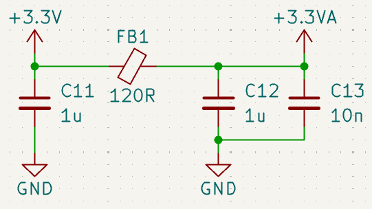

## Cortex Debug Connector (10-pins, 0.05")

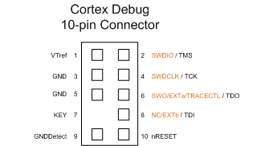

## Apilado estándar de 4 capas de JLCPCB

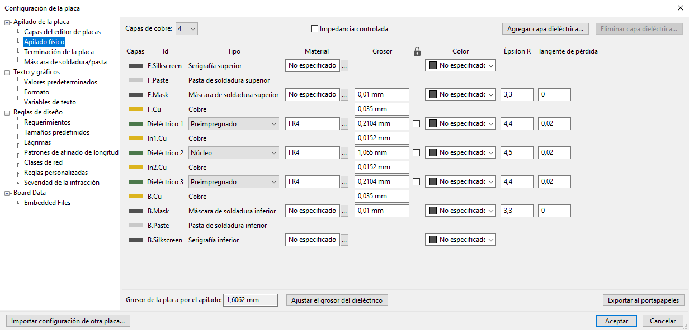

## Reglas de diseño JLCPCB

[Fabricante de PCB](https://jlcpcb.com/capabilities/pcb-capabilities).

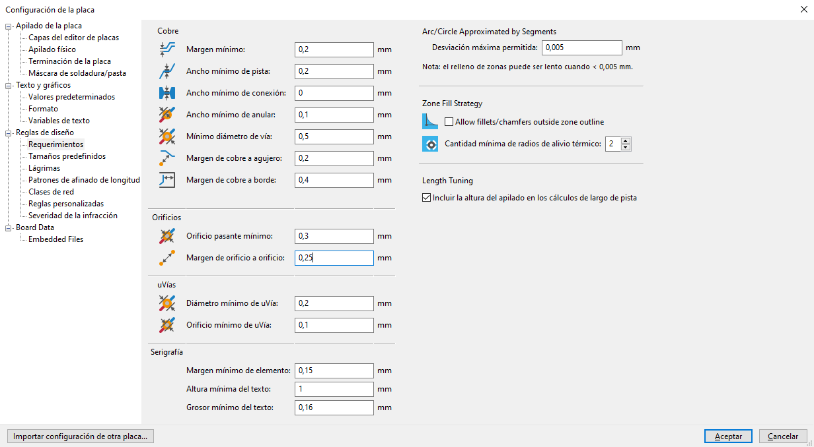

## Pasos para armar el Layout

📝Trabajar con una grilla de 1mm o 0,25mm.

❗Si hay restricciones mecánicas, primero dibujar el borde de la placa y posicionar agujeros de montaje.

1. Colocar el microcontrolador.
2. Separar los componentes en grupos funcionales.
3. Colocar los capacitores de desacople de 100n lo mas cerca posible del microcontrolador.
4. Colocar el filtro de conexión entre VDD y VDDA lo mas cerca posible del microcontrolador.
5. Colocar los capacitores de VCAP_1 y VCAP_2 lo mas cerca posible del microcontrolador.
6. Colocar el circuito del cristal lo mas cerca posible del microcontrolador.
7. Colocar el capacitor de desacople de 4u7 o 10u cerca del capacitor de 100n que está más alejado de la salida del regulador Buck.

📝Medir distancias con la regla.

8. Colocar elementos del BOOT0.
9. Colocar el led de status.
10. Colocar el conector USB (con su protección ESD lo más cerca posible).
11. Colocar el conector de la UART.
12. Colocar el conector I2C y sus resistencia (más cerca del host que del conector).
13. Colocar los conectores de Debug y +12V.
14. Colocar todos los componentes del circuito de alimentación dentro de un área pequeña.

📝Utilizar el layout sugerido en la hoja de datos del conversor Buck.
📝Si no hay layout sugerido, los componentes de la red de realimentación deben estar cerca del conversor Buck.
📝Si no hay layout sugerido, los componentes de la red de filtrado deben estar cercanos entre sí y del conversor Buck.
📝Si hubiese señales análogicas, deberían estar bastante separadas del área del conversor Buck.

15. Colocar leds indicadores de alimentación.
16. Colocar los agujeros de montaje.
17. Dibujar el borde de la placa.
18. Ajustar conectores y otros elementos utilizando la perspectiva 3D de KiCad.

❗JLCPCB no utiliza las capas F.Fab y B.Fab. Por lo que se puede, enviar la númeración de componetes al F.Fab para ahorrar espacio.

## Pasos para el ruteo

📝Un ancho de pista de 0,3mm es práctico para hacer conexiones directa con el microcontrolador.

1. Capacitores de desacople.
2. La pista de HSE_IN debe pasar por el medio del cristal.

📝Corregir la posición vertical del cristal manualmente.

3. Todas las conexiones del circuito del cristal deben realizarse en el top layer.
4. Las pistas I2C_SDA e I2C_SDL deben separarse al menos 2 a 3 veces su ancho, y lo mas cerca posible del microcontrolador para evitar Crosstalk.
5. Las pistas TX y RX de una USART deben separarse con el mismo criterio que las de I2C.
6. Las pistas de Debug son de baja frecuencia.

❗Las pistas de baja frecuencia se pueden pasar por el bottom layer mediante vías y deben ser lo mas cortas posibles.

7. Para las pistas del circuito de alimentación, se pueden utilizar zonas de cobre o pistas gruesas.

📝La herramienta de cálculo de KiCad permite estimar la corriente que puede circular por una pista.

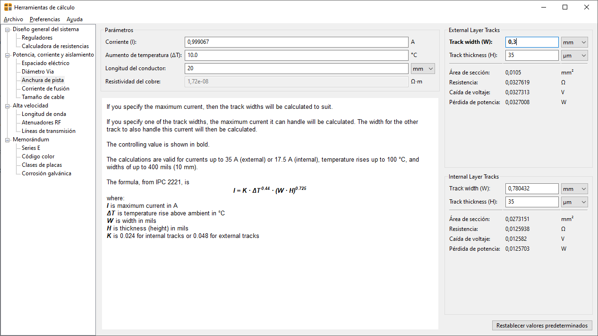

8. Las pistas USB son un par diferencial con impedancia controlada de 90.

📝Utilizar la herramienta [JLCPCB Impedance Calculator](https://jlcpcb.com/pcb-impedance-calculator) no la de KiCad.

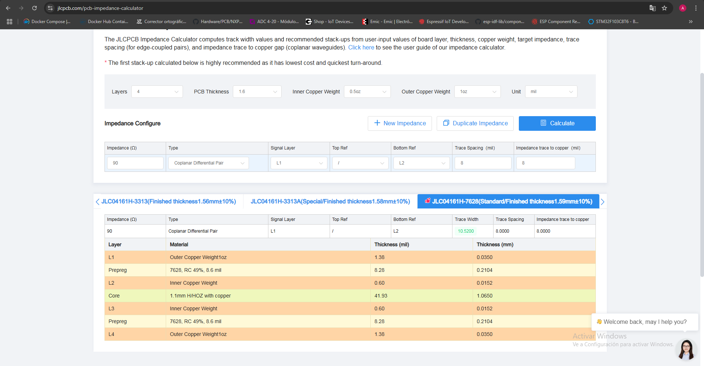

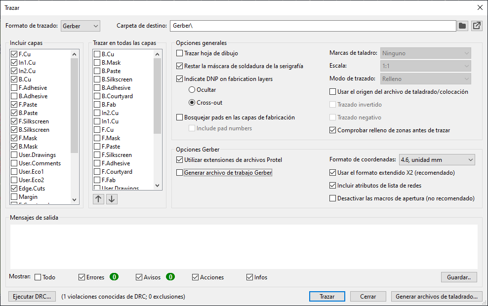

9. La pista de BOOT0 es de baja frecuencia.
10. Realizar las conexiones con los planos de GND y +3.3V con vías de 0,8mm/0,4mm.

❗Las vías deben colocarse lo mas cerca posible sin tocar los pads para minimizar la resistencia e inductancia parásita.

📝Puede que haga falta más de una vía en función de la corriente.

❗Para la conexión entre VDD y VDDA poner al menos 2 vías para minimizar la resistencia e inductancia parásita.

❗Conectar las vías a los pads con trazos cortos y anchos (0,5mm o más).

❗En el regulador Buck utilizar al menos 2 vías por pad. Excepto, en el inductor donde conviene que tenga al menos 4.

❗En el GND del USB poner al menos 4 vías.

11. Agregar serigrafía:

- Función de los conectores.
- Función de los leds.
- Pin positivo de diodos y capacitores.
- Pin número 1 de los circuitos integrados.
- Nombre de la placa.
- Logo.

## Manufactura

1. Agregar el texto `JLCJLCJLCJLC` en el layer F.Silkscreen.

📝[How to mark on PCB?](https://jlcpcb.com/help/article/How-to-remove-order-number-from-your-PCB)

2. Agregar 3 o 4 tooling holes.

❗Son circulos de radio 0,576mm hechos en el layer Edge.Cuts.

❗Los mismos deben hubicarse en esquinas opuestas de la placa y lo más apartados uno del otro.

📝[How to add tooling holes for PCB assembly order](https://jlcpcb.com/help/article/How-to-add-tooling-holes-for-PCB-assembly-order)

3. Generar los gerbers y comprimirlos.

4. Generar el drill file.

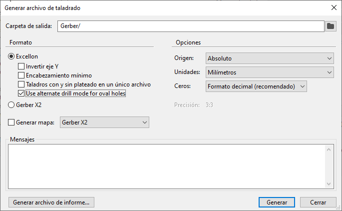

📝[How to Prepare Gerber Files Before Placing Orders?](https://jlcpcb.com/help/article/gerber-files-preparation)

📝[How to generate Gerber and Drill files in KiCAD 8?](https://jlcpcb.com/help/article/how-to-generate-gerber-and-drill-files-in-kicad-8)

5. Generar los pick and place files.

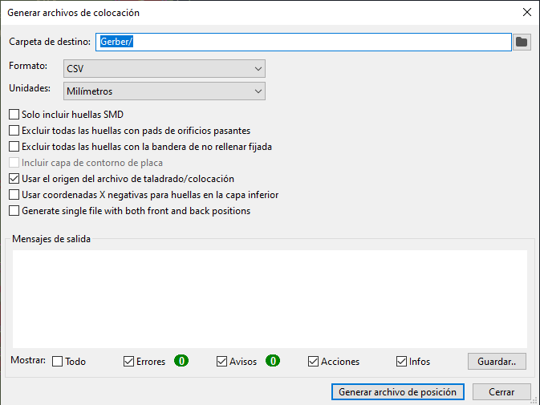

6. Modificar el nombre de las columnas de los pick and place files.

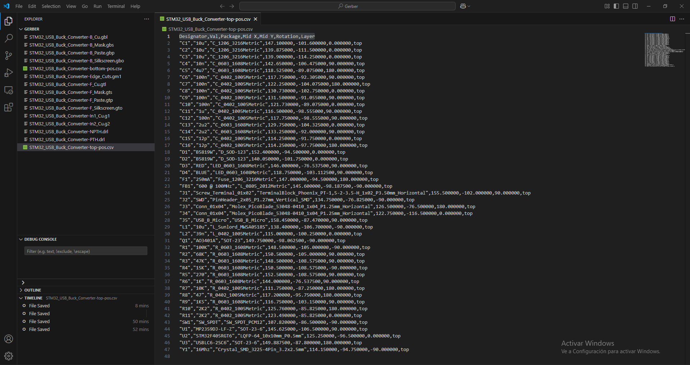

7. Abrir el editor de esquemas y agregarle a los símbolos un campo llamado `JLCPCB Part #`.
8. Ingresar el `JLCPCB Part #` de cada componente.

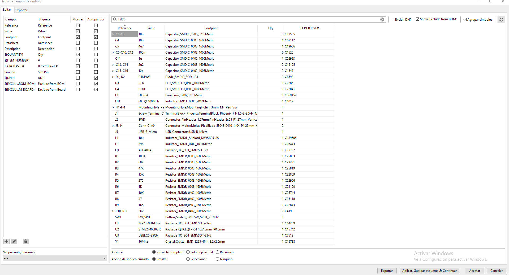

❗Por el momento JLCPCB no ofrece componentes THT. Los mismos, deberán ser comprados por [LCSC](https://www.lcsc.com/) y soldados manualmente.

9. Instalar la extensión `JLC PCB abrication Toolkit` de KiCad.
10. Abrir el editor de placas y generar el BOM.

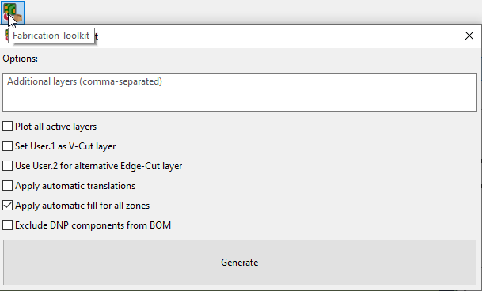

📝[Pick & Place File for PCB Assembly](https://jlcpcb.com/help/article/pick-place-file-for-pcb-assembly).

📝[Bill of Materials(BOM) File for PCB Assembly](https://jlcpcb.com/help/article/bill-of-materials-for-pcb-assembly)

📝[How to generate the BOM and Centroid file from KiCAD](https://jlcpcb.com/help/article/How-to-generate-the-BOM-and-Centroid-file-from-KiCAD).

11. Crear una cuenta en la página del fabricante.
12. Cargar los archivos y verificar como quedaría el PCB terminado.

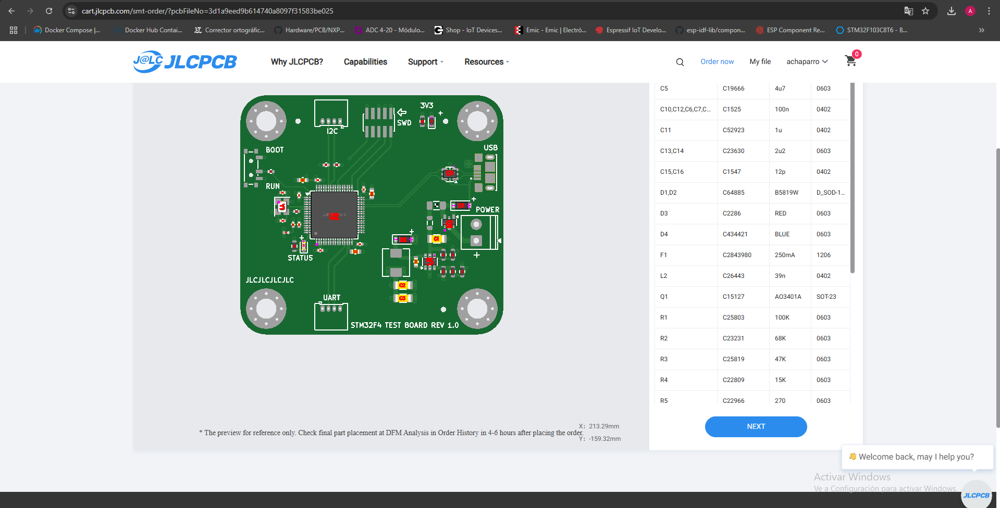
