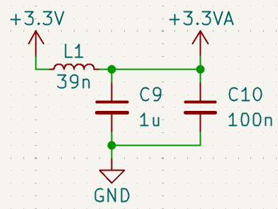

# KiCad STM32 + USB + Buck Converter PCB Design and JLCPCB Assembly

## Links

- [Fabricante de PCB](https://jlcpcb.com/).
- [Componentes](https://jlcpcb.com/parts).
- [Microcontrolador STM32 F4](https://jlcpcb.com/partdetail/Stmicroelectronics-STM32F405RGT6/C15742).
- [Conversor Buck](https://jlcpcb.com/partdetail/Monolithic_PowerSystems-MP2359DJ_LFZ/C14259).
- [Protección ESD para el USB](https://jlcpcb.com/partdetail/Stmicroelectronics-USBLC62SC6/C7519).
- [Cristal 16Mhz](https://jlcpcb.com/partdetail/Yxc_CrystalOscillators-X322516MLB4SI/C13738).
- [Protección Polaridad Inversa](https://jlcpcb.com/partdetail/Alpha_OmegaSemicon-AO3401A/C15127).
- [Ferrite para Conversores Buck](https://jlcpcb.com/partdetail/Sunlord-GZ2012D601TF/C1017).
- [Diodo Schottky recomendado para Conversores Buck](https://jlcpcb.com/partdetail/mdd_microdiode_semiconductor-B5819W/C64885).

## STM32CubeIde

📝En lo posible, colocar los buses de comunicación en distintos laterales del microcontrolador. Y en caso de no ser posible, colocarlos lo mas separados que se pueda dentro del mismo lateral.

❗En la imagen, se ve una mala ubicación para la USART1 porque queda muy cerca del USB_FS. Para solucionar el problema, se puede utlizar la USART3 que esta en otro lateral.

## Opciones para interconectar VDD con VDDA

